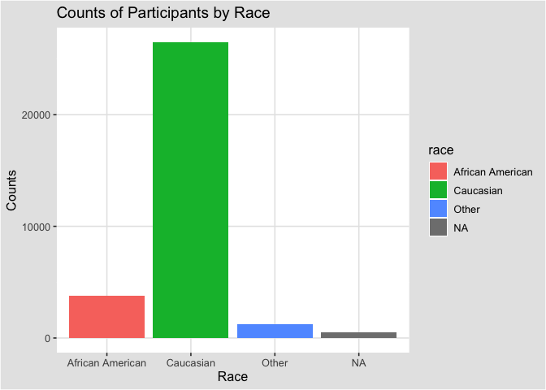
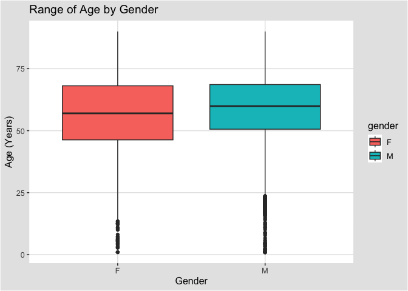
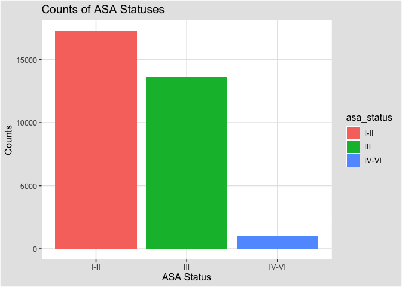
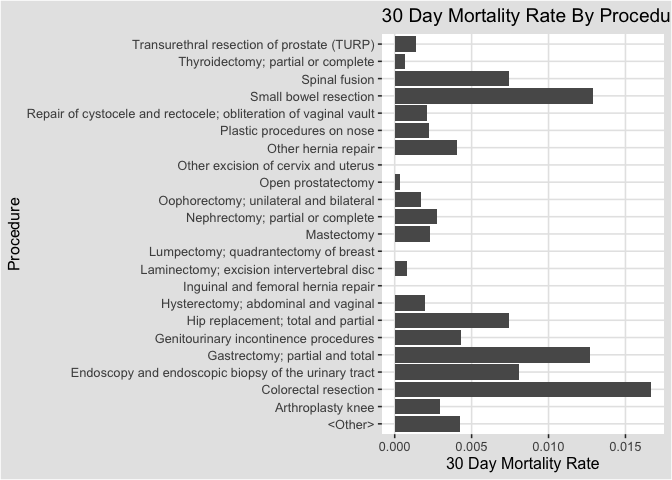

## Instructions
Answer the following questions and complete the exercises in RMarkdown. Please embed all of your code and push your final work to your repository. Your code should be organized, clean, and run free from errors. Remember, you must remove the `#` for any included code chunks to run. Be sure to add your name to the author header above.  

After the first 50 minutes, please upload your code (5 points). During the second 50 minutes, you may get help from each other- but no copy/paste. Upload the last version at the end of this time, but be sure to indicate it as final. If you finish early, you are free to leave.

Make sure to use the formatting conventions of RMarkdown to make your report neat and clean! Use the tidyverse and pipes unless otherwise indicated. To receive full credit, all plots must have clearly labeled axes, a title, and consistent aesthetics. This exam is worth a total of 35 points. 

Please load the following libraries.

```r
library("tidyverse")
library("janitor")
library("naniar")
library("ggthemes")
library("RColorBrewer")
```

## Data
These data are from a study on surgical residents. The study was originally published by Sessier et al. “Operation Timing and 30-Day Mortality After Elective General Surgery”. Anesth Analg 2011; 113: 1423-8. The data were cleaned for instructional use by Amy S. Nowacki, “Surgery Timing Dataset”, TSHS Resources Portal (2016). Available at https://www.causeweb.org/tshs/surgery-timing/.

Descriptions of the variables and the study are included as pdf's in the data folder.  

Please run the following chunk to import the data.

```r
surgery <- read_csv("data/surgery.csv")
```

1. (2 points) Use the summary function(s) of your choice to explore the data and get an idea of its structure. Please also check for NA's.

```r
glimpse(surgery)
```

```
## Rows: 32,001
## Columns: 25
## $ ahrq_ccs            <chr> "<Other>", "<Other>", "<Other>", "<Other>", "<Othe…
## $ age                 <dbl> 67.8, 39.5, 56.5, 71.0, 56.3, 57.7, 56.6, 64.2, 66…
## $ gender              <chr> "M", "F", "F", "M", "M", "F", "M", "F", "M", "F", …
## $ race                <chr> "Caucasian", "Caucasian", "Caucasian", "Caucasian"…
## $ asa_status          <chr> "I-II", "I-II", "I-II", "III", "I-II", "I-II", "IV…
## $ bmi                 <dbl> 28.04, 37.85, 19.56, 32.22, 24.32, 40.30, 64.57, 4…
## $ baseline_cancer     <chr> "No", "No", "No", "No", "Yes", "No", "No", "No", "…
## $ baseline_cvd        <chr> "Yes", "Yes", "No", "Yes", "No", "Yes", "Yes", "Ye…
## $ baseline_dementia   <chr> "No", "No", "No", "No", "No", "No", "No", "No", "N…
## $ baseline_diabetes   <chr> "No", "No", "No", "No", "No", "No", "Yes", "No", "…
## $ baseline_digestive  <chr> "Yes", "No", "No", "No", "No", "No", "No", "No", "…
## $ baseline_osteoart   <chr> "No", "No", "No", "No", "No", "No", "No", "No", "N…
## $ baseline_psych      <chr> "No", "No", "No", "No", "No", "Yes", "No", "No", "…
## $ baseline_pulmonary  <chr> "No", "No", "No", "No", "No", "No", "No", "No", "N…
## $ baseline_charlson   <dbl> 0, 0, 0, 0, 0, 0, 2, 0, 1, 2, 0, 1, 0, 0, 0, 0, 0,…
## $ mortality_rsi       <dbl> -0.63, -0.63, -0.49, -1.38, 0.00, -0.77, -0.36, -0…
## $ complication_rsi    <dbl> -0.26, -0.26, 0.00, -1.15, 0.00, -0.84, -1.34, 0.0…
## $ ccsmort30rate       <dbl> 0.0042508, 0.0042508, 0.0042508, 0.0042508, 0.0042…
## $ ccscomplicationrate <dbl> 0.07226355, 0.07226355, 0.07226355, 0.07226355, 0.…
## $ hour                <dbl> 9.03, 18.48, 7.88, 8.80, 12.20, 7.67, 9.53, 7.52, …
## $ dow                 <chr> "Mon", "Wed", "Fri", "Wed", "Thu", "Thu", "Tue", "…
## $ month               <chr> "Nov", "Sep", "Aug", "Jun", "Aug", "Dec", "Apr", "…
## $ moonphase           <chr> "Full Moon", "New Moon", "Full Moon", "Last Quarte…
## $ mort30              <chr> "No", "No", "No", "No", "No", "No", "No", "No", "N…
## $ complication        <chr> "No", "No", "No", "No", "No", "No", "No", "Yes", "…
```

```r
surgery%>% 
  summarise_all(~(sum(is.na(.))))
```

```
## # A tibble: 1 × 25
##   ahrq_ccs   age gender  race asa_status   bmi baselin…¹ basel…² basel…³ basel…⁴
##      <int> <int>  <int> <int>      <int> <int>     <int>   <int>   <int>   <int>
## 1        0     2      3   480          8  3290         0       0       0       0
## # … with 15 more variables: baseline_digestive <int>, baseline_osteoart <int>,
## #   baseline_psych <int>, baseline_pulmonary <int>, baseline_charlson <int>,
## #   mortality_rsi <int>, complication_rsi <int>, ccsmort30rate <int>,
## #   ccscomplicationrate <int>, hour <int>, dow <int>, month <int>,
## #   moonphase <int>, mort30 <int>, complication <int>, and abbreviated variable
## #   names ¹​baseline_cancer, ²​baseline_cvd, ³​baseline_dementia,
## #   ⁴​baseline_diabetes
```

```r
surgery%>% 
  summarise_all(~(sum(.==-999)))
```

```
## # A tibble: 1 × 25
##   ahrq_ccs   age gender  race asa_status   bmi baselin…¹ basel…² basel…³ basel…⁴
##      <int> <int>  <int> <int>      <int> <int>     <int>   <int>   <int>   <int>
## 1        0    NA     NA    NA         NA    NA         0       0       0       0
## # … with 15 more variables: baseline_digestive <int>, baseline_osteoart <int>,
## #   baseline_psych <int>, baseline_pulmonary <int>, baseline_charlson <int>,
## #   mortality_rsi <int>, complication_rsi <int>, ccsmort30rate <int>,
## #   ccscomplicationrate <int>, hour <int>, dow <int>, month <int>,
## #   moonphase <int>, mort30 <int>, complication <int>, and abbreviated variable
## #   names ¹​baseline_cancer, ²​baseline_cvd, ³​baseline_dementia,
## #   ⁴​baseline_diabetes
```

```r
surgery%>% 
  summarise_all(~(sum(.==0)))
```

```
## # A tibble: 1 × 25
##   ahrq_ccs   age gender  race asa_status   bmi baselin…¹ basel…² basel…³ basel…⁴
##      <int> <int>  <int> <int>      <int> <int>     <int>   <int>   <int>   <int>
## 1        0    NA     NA    NA         NA    NA         0       0       0       0
## # … with 15 more variables: baseline_digestive <int>, baseline_osteoart <int>,
## #   baseline_psych <int>, baseline_pulmonary <int>, baseline_charlson <int>,
## #   mortality_rsi <int>, complication_rsi <int>, ccsmort30rate <int>,
## #   ccscomplicationrate <int>, hour <int>, dow <int>, month <int>,
## #   moonphase <int>, mort30 <int>, complication <int>, and abbreviated variable
## #   names ¹​baseline_cancer, ²​baseline_cvd, ³​baseline_dementia,
## #   ⁴​baseline_diabetes
```

```r
# NAs are represented as NA
```


2. (3 points) Let's explore the participants in the study. Show a count of participants by race AND make a plot that visually represents your output.

```r
surgery%>%
  count(race)
```

```
## # A tibble: 4 × 2
##   race                 n
##   <chr>            <int>
## 1 African American  3790
## 2 Caucasian        26488
## 3 Other             1243
## 4 <NA>               480
```


```r
surgery%>%
  ggplot(aes(race, fill=race))+
  geom_bar()+
  theme_igray()+
  labs(title="Counts of Participants by Race",
         x="Race",
         y="Counts")
```

<!-- -->

3. (2 points) What is the mean age of participants by gender? (hint: please provide a number for each) Since only three participants do not have gender indicated, remove these participants from the data.

```r
surgery%>%
  filter(is.na(gender)==F)%>%
  filter(is.na(age)==F)%>%
  group_by(gender)%>%
  summarise(mean_age=mean(age))
```

```
## # A tibble: 2 × 2
##   gender mean_age
##   <chr>     <dbl>
## 1 F          56.7
## 2 M          58.8
```

4. (3 points) Make a plot that shows the range of age associated with gender.

```r
surgery%>%
  filter(is.na(gender)==F)%>%
  filter(is.na(age)==F)%>%
  ggplot(aes(gender, age, fill=gender))+
  geom_boxplot()+
  theme_igray()+
  labs(title="Range of Age by Gender",
         x="Gender",
         y="Age (Years)")
```

<!-- -->

5. (2 points) How healthy are the participants? The variable `asa_status` is an evaluation of patient physical status prior to surgery. Lower numbers indicate fewer comorbidities (presence of two or more diseases or medical conditions in a patient). Make a plot that compares the number of `asa_status` I-II, III, and IV-V.

```r
surgery%>%
  filter(is.na(asa_status)==F)%>%
  ggplot(aes(asa_status, fill=asa_status))+
  geom_bar()+
  theme_igray()+
  labs(title="Counts of ASA Statuses",
         x="ASA Status", # Note: rename values to healthy -> unhealthy
         y="Counts")
```

<!-- -->

6. (3 points) Create a plot that displays the distribution of body mass index for each `asa_status` as a probability distribution- not a histogram. (hint: use faceting!)

```r
surgery%>%
  filter(is.na(bmi)==F)%>%
  filter(is.na(asa_status)==F)%>%
  ggplot(aes(bmi, color=asa_status))+
  geom_density()+
  theme_igray()+
  facet_wrap(~asa_status)+
  labs(title="Density Distribution of BMI for ASA Statuses",
         x="BMI", # Note: rename values to healthy -> unhealthy
         y="Density")
```

<!-- -->

The variable `ccsmort30rate` is a measure of the overall 30-day mortality rate associated with each type of operation. The variable `ccscomplicationrate` is a measure of the 30-day in-hospital complication rate. The variable `ahrq_ccs` lists each type of operation.  

7. (4 points) What are the 5 procedures associated with highest risk of 30-day mortality AND how do they compare with the 5 procedures with highest risk of complication? (hint: no need for a plot here)

```r
surgery%>%
  group_by(ahrq_ccs)%>%
  summarise(mean_mortality=mean(ccsmort30rate))%>%
  as.data.frame()%>%
  slice_max(order_by = mean_mortality, n=5)
```

```
##                                               ahrq_ccs mean_mortality
## 1                                 Colorectal resection     0.01667328
## 2                                Small bowel resection     0.01290323
## 3                       Gastrectomy; partial and total     0.01269036
## 4 Endoscopy and endoscopic biopsy of the urinary tract     0.00810811
## 5                                        Spinal fusion     0.00742391
```


```r
surgery%>%
  group_by(ahrq_ccs)%>%
  summarise(mean_complication_risk=mean(ccscomplicationrate))%>%
  as.data.frame()%>%
  slice_max(order_by = mean_complication_risk, n=5)
```

```
##                           ahrq_ccs mean_complication_risk
## 1            Small bowel resection              0.4661290
## 2             Colorectal resection              0.3120286
## 3 Nephrectomy; partial or complete              0.1973048
## 4   Gastrectomy; partial and total              0.1903553
## 5                    Spinal fusion              0.1833704
```

8. (3 points) Make a plot that compares the `ccsmort30rate` for all listed `ahrq_ccs` procedures.

```r
surgery%>%
  group_by(ahrq_ccs)%>%
  summarise(mean_mortality=mean(ccsmort30rate))%>%
  as.data.frame()%>%
  ggplot(aes(ahrq_ccs, mean_mortality))+
  geom_col()+
  theme_igray()+
  coord_flip()+
  labs(title="30 Day Mortality Rate By Procedure",
         x="Procedure",
         y="30 Day Mortality Rate")
```

<!-- -->


9. (4 points) When is the best month to have surgery? Make a chart that shows the 30-day mortality and complications for the patients by month. `mort30` is the variable that shows whether or not a patient survived 30 days post-operation.

```r
# Variables are in the form: Survived 30 days?_Complications?
yes_no<-surgery%>%
  filter(mort30=='Yes')%>%
  count(month)%>%
  as.data.frame()%>%
  rename(survived=n)

no_yes<-surgery%>%
  filter(complication=='No')%>%
  count(month)%>%
  as.data.frame()%>%
  rename(no_complications=n)

yes_yes<-surgery%>%
  filter(mort30=='Yes' & complication=='No')%>%
  count(month)%>%
  as.data.frame()%>%
  rename(survived_with_no_complications=n)

month_data<-bind_cols(yes_no, no_yes)
```

```
## New names:
## • `month` -> `month...1`
## • `month` -> `month...3`
```

```r
month_data<-bind_cols(month_data, yes_yes)
```

```
## New names:
## • `month` -> `month...5`
```

```r
month_data$month = month_data$month...1
month_data<-month_data%>%
  select(month, survived, no_complications, survived_with_no_complications)
month_data
```

```
##    month survived no_complications survived_with_no_complications
## 1    Apr       12             2377                              8
## 2    Aug        9             2715                              7
## 3    Dec        4             1602                              3
## 4    Feb       17             2163                             11
## 5    Jan       19             2263                             11
## 6    Jul       12             2024                              9
## 7    Jun       14             2584                             10
## 8    Mar       12             2373                             10
## 9    May       10             2321                              7
## 10   Nov        5             2219                              2
## 11   Oct        8             2312                              6
## 12   Sep       16             2784                             10
```

10. (4 points) Make a plot that visualizes the chart from question #9. Make sure that the months are on the x-axis. Do a search online and figure out how to order the months Jan-Dec.

```r
month_data%>%
  pivot_longer(cols=-month, names_to = "status", values_to = "n")%>%
  ggplot(aes(month, n))+
  geom_col()+
  theme_igray()+
  scale_x_discrete(limits=month.abb)+
  facet_wrap(~status, ncol=3, scales="free_y")+
  theme(axis.text.x = element_text(angle = 60, hjust = 1))+
  labs(title="Procedure Survivability and Complications per Month",
       x="Month",
       y="Count")
```

<!-- -->

Please provide the names of the students you have worked with with during the exam:

Please be 100% sure your exam is saved, knitted, and pushed to your github repository. No need to submit a link on canvas, we will find your exam in your repository.
